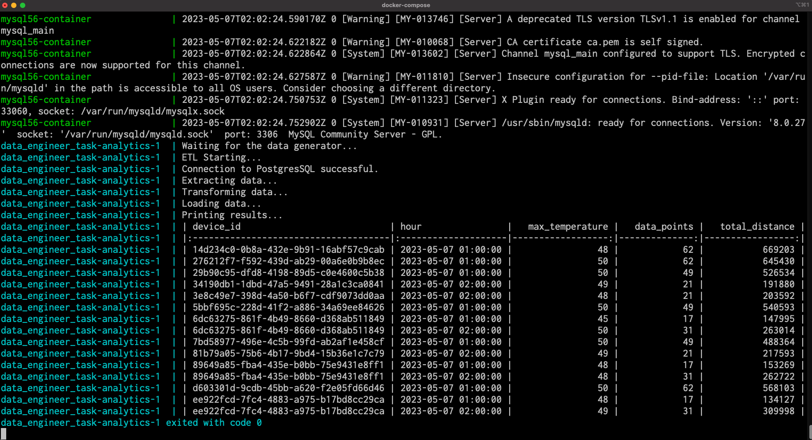

# Instructions

## Running the docker

To get started run ``` docker-compose up ``` in root directory.
It will create the PostgresSQL database and start generating the data.
It will create an empty MySQL database.
It will launch the analytics.py script. 

Your task will be to write the ETL script inside the analytics/analytics.py file.


# Solution



To see the above result just run `docker compose up`


# Some comments

I need to make a small fix in the script used for inserting data into the postgres database. Using the code provided, the table `devices` stays empty. To see it, run:

```
docker compose up -d
```

Then list the containers and watch the logs of main service:

```
docker ps

CONTAINER ID   IMAGE                     STATUS         CREATED         PORTS
e0640e4689c1   data_engineer_task-main   Up 2 seconds   3 seconds ago
9995c667061f   postgres:9.5.15           Up 2 seconds   3 seconds ago   5432/tcp
da5454922b68   mysql:8.0.27              Up 2 seconds   3 seconds ago   3306/tcp, 33060/tcp

docker logs e06 -f
```

Eventually, the terminal will print several lines like:

```
fca98f30-1779-4fb3-b5b2-4dd4c3367070 1683411915
b292b17b-37ce-4ceb-b753-559d37e08005 1683411916
a411a64d-04ea-413f-85b3-71b3ebb0132d 1683411916
fca98f30-1779-4fb3-b5b2-4dd4c3367070 1683411916
b292b17b-37ce-4ceb-b753-559d37e08005 1683411917
a411a64d-04ea-413f-85b3-71b3ebb0132d 1683411917
fca98f30-1779-4fb3-b5b2-4dd4c3367070 1683411917
b292b17b-37ce-4ceb-b753-559d37e08005 1683411918
a411a64d-04ea-413f-85b3-71b3ebb0132d 1683411918
fca98f30-1779-4fb3-b5b2-4dd4c3367070 1683411918
b292b17b-37ce-4ceb-b753-559d37e08005 1683411919
a411a64d-04ea-413f-85b3-71b3ebb0132d 1683411919
fca98f30-1779-4fb3-b5b2-4dd4c3367070 1683411919
b292b17b-37ce-4ceb-b753-559d37e08005 1683411920
a411a64d-04ea-413f-85b3-71b3ebb0132d 1683411920
```

This is the content of the print function in line 39 in main.py and happend after the execution of the connection with the database. The script runs correctly but note that the transaction is never commited, so the data is not being added to the table. To confirm it, attach a shell to the postgres container:

```
docker exec -it 999 bash
```

connect to the database and query the table

```
psql -h localhost -U $POSTGRES_USER -d $POSTGRES_DB -W
select *
from public.devices
limit 10;
```

Returns:

```
 device_id | temperature | location | time
-----------+-------------+----------+------
(0 rows)
```

To solve this, I just add a line to main.py to commit the transaction:

```python
[...]
39 conn.execute(ins, data)
40 conn.commit()
```

After this change, I was able to proceed with the exercise.


